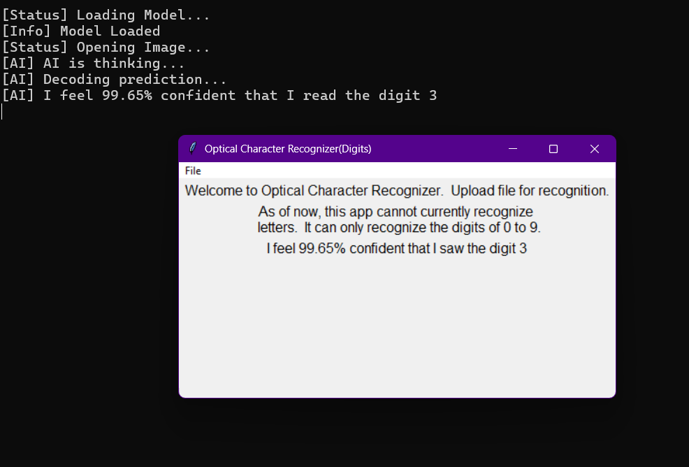

# OCR-Model
Simple OCR for recognizing numbers and digits as of now.

_______________________________
This was a project I made, for fun, mainly because I wanted to practice AI, and learn more Neural networks, and also contribute to my Github.   

         

The AI can only recognize individual characters by themselves, although I eventually plan to make it recognize full sentences and paragraphs like this.  It uses a Convolutional Neural Network(CNN), followed by a dense MLP in order to analyze and process them.  A softmax function is then applied to output its classifications.   
 

&nbsp; Also, I plan on this being my first REPO to have a release.  
  I will add the releases soon, as both its ZIP, and its EXE, 
  which contain the model's pt and the program for interacting with it.  

Latest notes:  The AI is extremely inaccurate, i plan on fixing that later.

